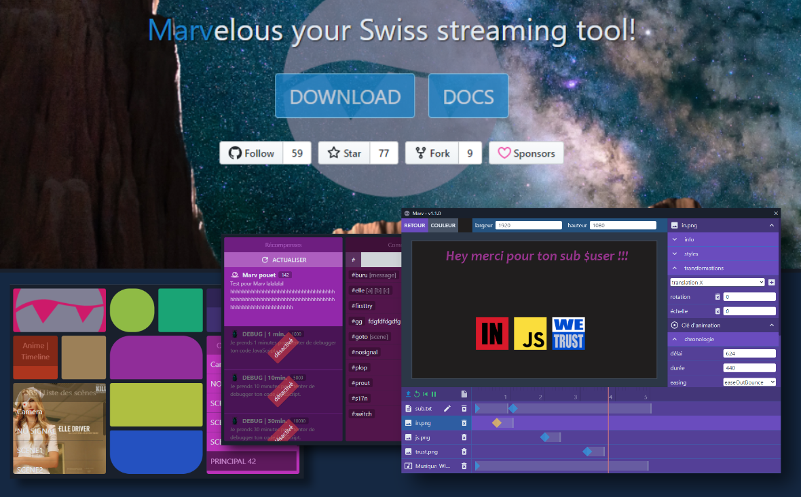

# Marv // StreamDeck Like // Twitch Bot

WIP Projet développé en live sur la chaîne [twitch.tv/skarab42](https://www.twitch.tv/skarab42).



# Installation

- Download and install from [here](https://github.com/skarab42/marv/releases) (win/mac/linux).

## OBS WebSocket

- For OBS to work with Marv you need to install [obs-websocket](https://github.com/Palakis/obs-websocket/releases).

# Contribute ?!

## Project setup

```bash
# Clone this repository
git clone https://github.com/skarab42/marv

# change directory to cloned path
cd marv

# install all dependencies
yarn install
yarn build
yarn app:build

# run application in development mode
yarn watch

# run application in production mode
yarn start

# build application in production mode
yarn build
yarn app:build

# lint project
yarn lint
```

## How to build with npm (easier from ubuntu?):

```
cd marv
npm install
npm run tailwind:build --prod
npm run client:build
npm run app:build
```

Credit: thermo74 :)

## Translations

- Spanish by TerminabloxHD
- French by Skarab42
- English by Skarab42
